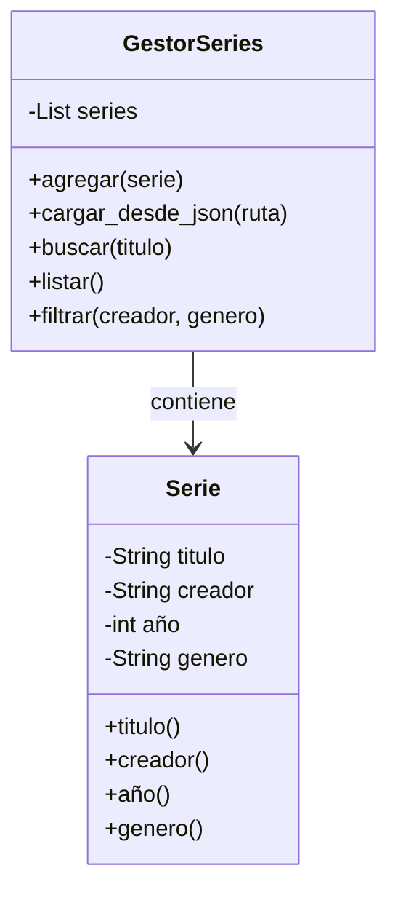

# Propuesta del proyecto

## Nombre del proyecto
CrossVerse

## Dominio elegido
Series (especialmente K-dramas), con un catalogo curado en base a las series del actor Lee Jomg-suk.

Elegimos este dominio porquea uno de los integrante tiene mucho conocimiento sobre las series y es un tema que consume habitualmente. Armamos el datset con dramas protagonizados/colaborado por Lee Jong-suk, lo que nos permitio trabajar con datos reales.

## Problema que resuelve
Muchas personas no saben que serie ver a continuacion entre la enorme cantidad de opciones disponibles. El sistema ayuda a encontrar series segun genero, calificacion o similitud con otras que ya vieron, dentro de la filmografia de un mismo actor.

## Usuario objetivo
Fanatico de los k-dramas y en particular de Lee Jong-suk, que ya vio algunas de sus series y busca descubrir el resto de su filmografia.

## 5 funcionalidades iniciales
1. Agregar serie al catalogo
2. Cargar series desde un archivo Json
3. Buscar serie por titulo
4. Listar todas las series
5. Filtrar por creador o genero

## Ejemplo de interaccion

## === Sistema de recomendacion de Series ===

1. Agregar serie
2. Buscar serie
3. Listar series
4. Filtrar series 
5. salir

Opcion a elegir: 2

Buscar por titulo: Doctor Stranger

Doctor stranger(2014)- Park Jin-woo

Hasta luego!

## Diagrama inical de clases

