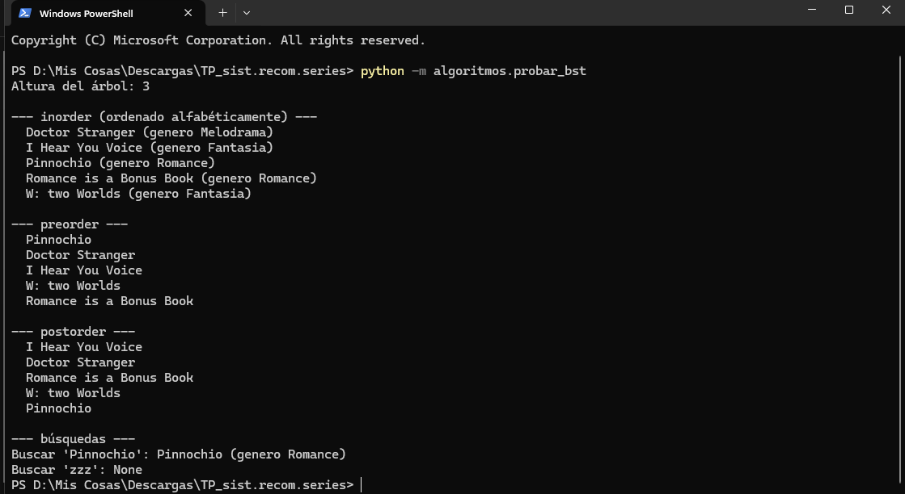
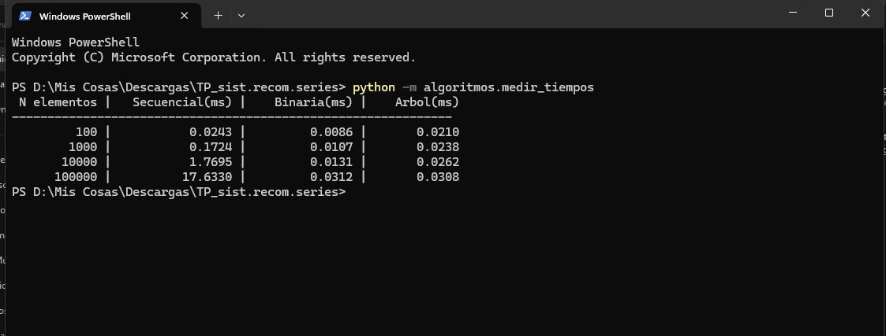

# Análisis TP3 — Árbol Binario de Búsqueda

## 1. ¿Qué resolvimos?
Incorporamos un **árbol binario de búsqueda (BST)** para resolver la
búsqueda por **titulo** de forma más eficiente.

## 2. Clave de ordenamiento
Ordenamos por titulo porque es el criterio principal por el que el usuario busca una serie en el menu(opcion "Buscar serie"). Al ordenar por `titulo.lower()`, evitamos que mayusculas o minusculas afecten la posicion del elemento en el arbol.

## 3. Prueba del árbol
Salida de `python -m algoritmos.probar_bst`:

## 4. Comparación de tiempos
En la tabla siguiente, los tiempos son **reales**, sacados con nuestro
script `algoritmos/medir_tiempos.py`. NO inventar números.
| N elementos | Secuencial (ms) | Binaria (ms) | Árbol BST (ms) |
|---|---:|---:|---:|
| 100 | [0.0243] | [0.0086] | [0.0210] |
| 1.000 | [0.1724] | [0.0107] | [0.0238] |
| 10.000 | [1.7695] | [0.0131] | [0.0262] |
| 100.000 | [17.6330] | [0.0312] | [0.0308] |

## 5. Análisis de complejidad
- **Búsqueda secuencial:** O(n). Recorre toda la lista en el peor caso.
- **Búsqueda binaria:** O(log n) pero exige lista ordenada (ordenar cuesta O(n log n) una sola vez)
- **Búsqueda en árbol:** O(log n) promedio si el árbol está balanceado;
  O(n) en el peor caso si está degenerado (como una lista).
- **Inserción en árbol:** O(log n) promedio, O(n) peor caso.
- **Recorridos (inorder, preorder, postorder):** O(n), porque visitan cada nodo 1 vez.
  
## 6. Conclusión
Con 100.000 elementos, la busqueda secuencial tarda 17.6330 ms, la binaria 0.0312 ms y el Arbol 0.0308 ms - tanto la binaria como el arbol son mas de 570 veces mas rapidos que la secuencial. La binaria y el arbol quedan practicamente empatados en este caso, porque el arbol esta balanceado(los datos se insertaron sin orden previo). A medida que aumenta la cantidad de series, la secuencial crece de forma lineal mientras que la binaria y arbol se mantienen casi constantes. El arbol tiene una ventaja adicional sobre la binaria ordenada: permite insertar y buscar elemntos nuevos sin tener que reordenar toda la lista cada vez, lo cual conviene si el catalogo de series se sigue actualizando.

## 7. Errores o dudas que tuvimos
[]