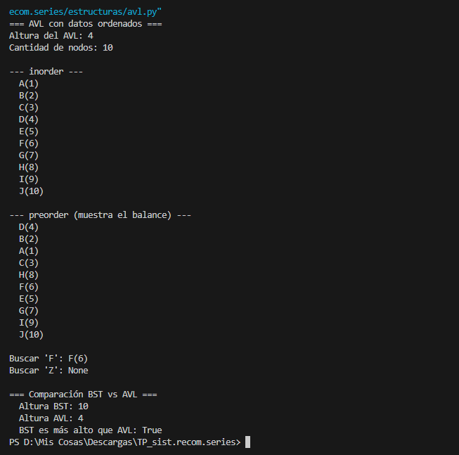
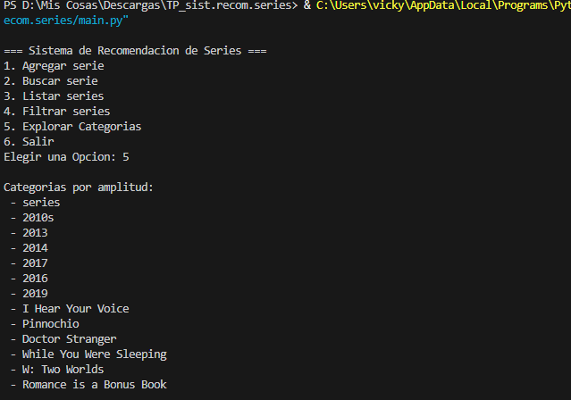
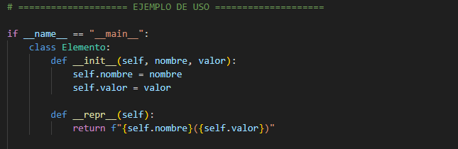
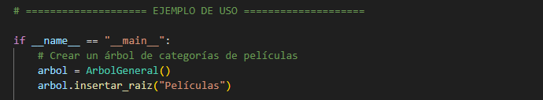
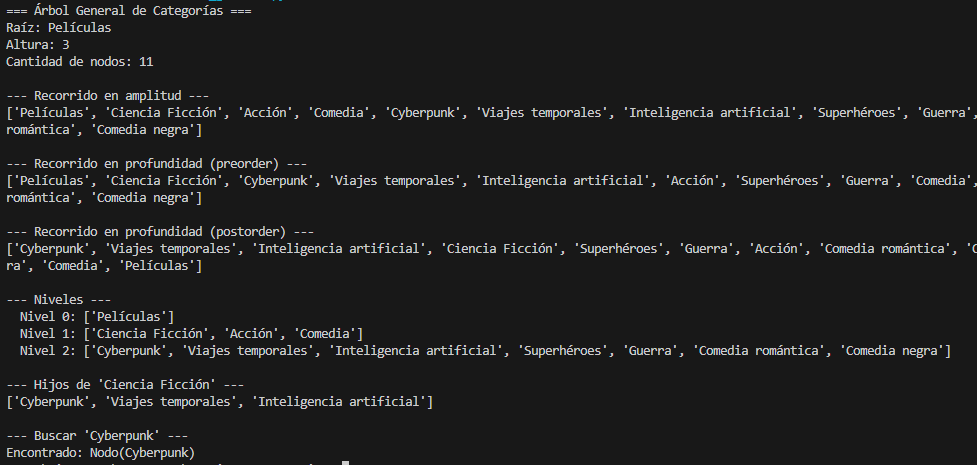
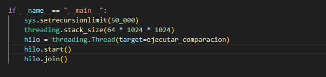
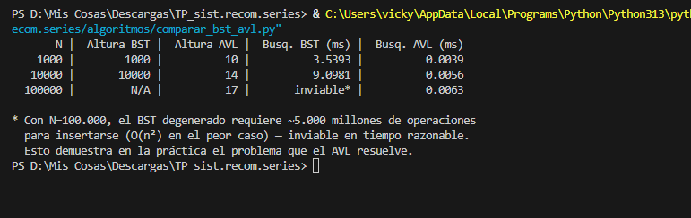

# Análisis TP4 + TP5 — AVL y Árbol General

## 1. ¿Qué resolvimos?
- **AVL**: búsquedas rápidas por título (O(log n)) sin importar el orden de inserción. Se usa en la opción "Buscar".
- **Árbol General**: jerarquía de categorías (Década → Año → Serie). Se usa en "Explorar Categorías".

## 2. TP4 — Árbol AVL

**¿Por qué AVL y no BST?** Un BST común se desbalancea con datos ordenados, degenerando en una lista (O(n) por búsqueda). El AVL se autobalancea con rotaciones y mantiene O(log n).

**Rotaciones implementadas:** simple izquierda, simple derecha, doble izquierda-derecha, doble derecha-izquierda.

**Comparación BST vs AVL** (datos insertados ya ordenados — peor caso):

| N | Altura BST | Altura AVL | Búsqueda BST (ms) | Búsqueda AVL (ms) |
|---|---:|---:|---:|---:|
| 1.000 | 1.000 | 10 | 3.54 | 0.0039 |
| 10.000 | 10.000 | 14 | 9.10 | 0.0056 |
| 100.000 | inviable* | 17 | — | 0.0063 |

\* Con 100.000 elementos ordenados, el BST degenerado necesita ~5.000 millones de operaciones para insertarse (O(n²)). El AVL resolvió el mismo caso en milisegundos.

**Prueba (`python estructuras/avl.py`):**


## 3. TP5 — Árbol General

**Jerarquía elegida:** Serie → Décadas (2010s) → Años (2013, 2014, 2016, 2017, 2019) → Títulos.

**Por qué:** la década/año es un dato objetivo y permite explorar el catálogo sin recordar el título exacto. Complementa al AVL: uno busca exacto, el otro navega.

**Prueba (opción 5 del menú):**


## 4. Integración en main.py

```python
from estructuras.avl import AVL
from estructuras.arbol_general import ArbolGeneral

avl = AVL()
for serie in gestor.listar():
    avl.insertar(serie, clave=lambda e: e.titulo.lower())

arbol_categorias = construir_arbol_categorias(gestor.listar())
```
- Opción "Buscar" → `avl.buscar(titulo.lower(), clave=lambda e: e.titulo.lower())`
- Opción "Explorar Categorías" → `arbol_categorias.amplitud()`

## 5. Complejidad

| Operación | AVL | Árbol General |
|---|---|---|
| Inserción | O(log n) | O(1) |
| Búsqueda | O(log n) | O(n) |
| Altura peor caso | O(log n) | O(n) |

El AVL mantiene el factor de balance entre -1 y +1 en cada nodo, por eso su altura queda proporcional a log₂(n) (con 10.000 elementos, altura real 14 vs. log₂(10.000) ≈ 13.3). El árbol general no necesita balancearse porque no ordena por valor, sino que refleja una jerarquía natural con pocas categorías.

## 6. Conclusión
El AVL resuelve el desbalance del BST de forma demostrable: con 100.000 elementos en el peor orden, el BST fue directamente inviable de construir, mientras el AVL respondió en 0.0066 ms. El árbol general complementa esto permitiendo explorar el catálogo quien no recuerda el título exacto.

## 7. Errores o dudas que tuvimos
Al medir el BST con 100.000 elementos ordenados, el proceso no terminaba (complejidad O(n²) para insertar en ese orden). Tuvimos que subir el límite de recursión de Python y correr el script en un hilo con más memoria de pila. Finalmente decidimos documentar ese caso como inviable en vez de forzar una espera de horas — es, de hecho, la prueba más clara de por qué el AVL es necesario.

## 8. Datos y evidencia
- `estructuras/avl.py`, `estructuras/arbol_general.py`: pruebas propias de cada estructura
 
 
- `algoritmos/comparar_bst_avl.py`: script de la comparación
 

